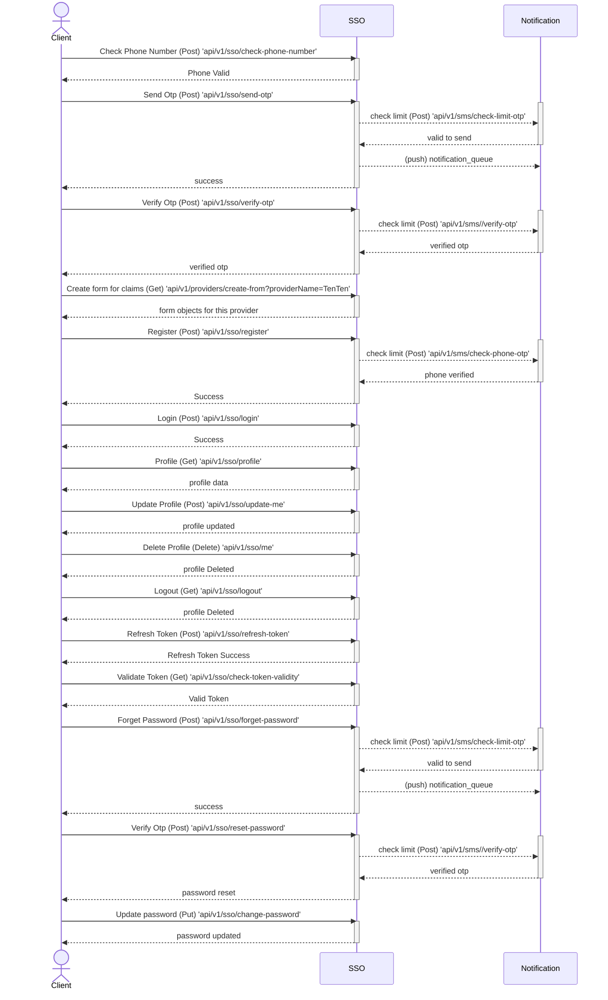

```mermaid
sequenceDiagram
    Actor Client
    participant SSO
    participant Notification
    # check phone api
    Client->>SSO: Check Phone Number (Post) 'api/v1/sso/check-phone-number'
    activate SSO
    SSO -->>Client: Phone Valid
    deActivate SSO

    # Send Otp
    Client->>SSO: Send Otp (Post) 'api/v1/sso/send-otp'
    activate SSO
    activate Notification
    SSO -->>Notification: check limit (Post) 'api/v1/sms/check-limit-otp'
    Notification -->>SSO: valid to send
    deActivate Notification
    SSO -->>Notification: (push) notification_queue
    SSO -->>Client: success
    deActivate SSO

    # Verify Otp
    Client->>SSO: Verify Otp (Post) 'api/v1/sso/verify-otp'
    activate SSO
    activate Notification
    SSO -->>Notification: check limit (Post) 'api/v1/sms//verify-otp'
    Notification -->>SSO: verified otp
    deActivate Notification
    SSO -->>Client: verified otp
    deActivate SSO

    #Create Form Builder 
    Client->>SSO: Create form for claims (Get) 'api/v1/providers/create-from?providerName=TenTen'
    activate SSO
    SSO -->>Client: form objects for this provider
    deActivate SSO

    #Register 
    Client->>SSO: Register (Post) 'api/v1/sso/register'
    activate SSO
    activate Notification
    SSO -->>Notification: check limit (Post) 'api/v1/sms/check-phone-otp'
    Notification -->>SSO: phone verified
    deActivate Notification
    SSO -->>Client: Success
    deActivate SSO

    #Login 
    Client->>SSO: Login (Post) 'api/v1/sso/login'
    activate SSO
    SSO -->>Client: Success
    deActivate SSO

    #Profile 
    Client->>SSO: Profile (Get) 'api/v1/sso/profile'
    activate SSO
    SSO -->>Client: profile data
    deActivate SSO

    #Update profile 
    Client->>SSO: Update Profile (Post) 'api/v1/sso/update-me'
    activate SSO
    SSO -->>Client: profile updated
    deActivate SSO

    #Delete profile 
    Client->>SSO: Delete Profile (Delete) 'api/v1/sso/me'
    activate SSO
    SSO -->>Client: profile Deleted
    deActivate SSO

    #Logout 
    Client->>SSO: Logout (Get) 'api/v1/sso/logout'
    activate SSO
    SSO -->>Client: profile Deleted
    deActivate SSO

    #Refresh Token
    Client->>SSO: Refresh Token (Post) 'api/v1/sso/refresh-token'
    activate SSO
    SSO -->>Client: Refresh Token Success
    deActivate SSO

    #Validate Token
    Client->>SSO: Validate Token (Get) 'api/v1/sso/check-token-validity'
    activate SSO
    SSO -->>Client: Valid Token
    deActivate SSO

    #Forget Password
    Client->>SSO: Forget Password (Post) 'api/v1/sso/forget-password'
    activate SSO
    activate Notification
    SSO -->>Notification: check limit (Post) 'api/v1/sms/check-limit-otp'
    Notification -->>SSO: valid to send
    deActivate Notification
    SSO -->>Notification: (push) notification_queue
    SSO -->>Client: success
    deActivate SSO

    # Reset Password
    Client->>SSO: Verify Otp (Post) 'api/v1/sso/reset-password'
    activate SSO
    activate Notification
    SSO -->>Notification: check limit (Post) 'api/v1/sms//verify-otp'
    Notification -->>SSO: verified otp
    deActivate Notification
    SSO -->>Client: password reset
    deActivate SSO

    #Update password 
    Client->>SSO: Update password (Put) 'api/v1/sso/change-password'
    activate SSO
    SSO -->>Client: password updated
    deActivate SSO
```

